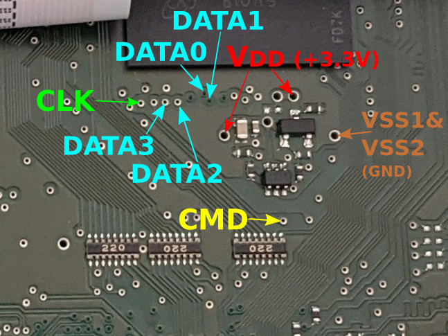
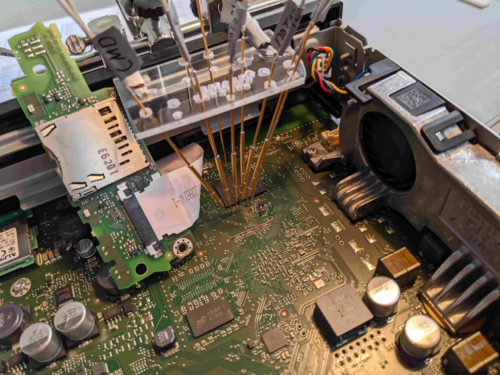

# Upgrade MIB2 STD ZR Firmware (without Navigation)
## About
This repository contains some scripts and documentation how to upgrade the MIB2 firmware to a different HW train (e.g.: 02xx -> 03xx, 04xx). 
The documentation is for the Technisat MIB2 STD unit without navigation. 
It describes how to patch the `swdownload` binary, that the unit accepts updates for a higher HW train.  
In addition to this repository it's required to have access to the `MIB Solutions` folder on MEGA.nz (Link can be found in various forums and is changing from time to time. Just google for it). There you find the firmware updates and tools to patch the `swdownload` binary.
Such an update is was not intended by the manufacturer.  
You will **loose your warranty** and there is a **chance to brick your device**. Everything you do is by your own risk. 

## Limitations of the MIB2 STD without navigation
For MIB2 without navigation it's currently not possible to patch the `swdownload` binary with the `Update-Approval_SOP4_signed` method, because of the different CPU (`cpuplus` instead of `cpu`).
To patch the `swdownload` you have to dump the eMMC, exchange the binary and write everything back to the unit.  
The eMMC of the MIB2 with navigation can be read with an adapter from the second SD card reader. 
For the model without navigation the only way to read the eMMC is to connect to the through-hole plating on the PCB. 
This can be done by soldering very thin wires to the holes or contact them with probes. 

## Upgrade procedure
1. Connect a SD card reader to the eMMC through-hole plating (soldering or probes).
For me the connection was only stable with DATA0 connected and DATA1-3 unconnected (-> slow read & write)
    - Note: Not all SD card reader are supporting a single connected data line. 
    I used a SD card reader from _Hama_ with a clear case and model number _00091092_.
    - Soldering can be difficult, as there're big cooper planes pulling away the heat. 
    Oxidation and solder resist should be removed in front. 
    - eMMC pinout (connecting to both Vdd signals probably required):  
    
    - See [this image](https://www.electroniccircuitsdesign.com/sites/default/files/img/sd-card-pinout.png) for a SD card pinout
    - example of probes soldered to a USB SD card reader (alternative pinout)
    

2. Dump the eMMC content to your Linux Host and convert it to a `*.vmdk` file. Execute [this script](./scripts/dump_emmc.sh) to do it. 
3. Start your QNX VM (image can be found in the MEGA folder) and add the vmdk file as virtual hard disk. 
4. Copy the `swdownload` binary from the vmdk file to your host. In the QNX VM you find it under following path `/fs/hd1-qnx6/tsd/bin/swdownload/tsd.mibstd2.system.swdownload`. You can use SSH to copy it from QNX VM to your host. 
5. Patch the `swdownload` binary with the python scripts or `SWDLPatcher.exe` from the `MIB Solutions` folder on MEGA. 
6. Rename the patched swdownload binary to the origin name, copy it the QNX VM and overwrite the origin one in the vmdk. 
7. Shutdown the QNX VM. 
8. Convert the vmdk file back to a raw disk dump and write it to the eMMC. Execute [this script](./scripts/write_vmdk_to_emmc.sh) to do it. 
9. Get the CPU ID of your MIB2 unit. 
    - Power it up, press menu button for 10 sec., select FW -> version -> current version -> cpu or cpuplus. 
    - The CPU ID is the number in braces. 
10. Take the firmware to which you like to update and patch the `metainfo2.txt` file. 
    - In this file you have to add links to your CPU ID and set `RequiredVersionOfDM` to `RequiredVersionOfDM = "0"`
    - Find a section which starts with `cpu` and get the used CPU ID in that firmware (e.g.:`[cpu\audioservice\36\default\Application]` --> CPU ID: 36)
    - Execute [this python script](./scripts/metainfo_parser.py) to patch the `metainfo2.txt` file. (e.g.: your CPU ID: 18; target firmware CPU ID: 36 --> `python3 metainfo_parser.py metainfo2.txt metainfo2_patched.txt 36 18`
11. Rename the patched `metainfo2.txt` file to the origin name and overwrite the one in the firmware folder. 
12. Format a SD card with FAT32 and copy the firmware to it (`metainfo2.txt` must be in top level on the SD card). 
13. Put the SD card in your MIB2 card reader and start the update. 

Maybe you will get a SVM Error after the update. 
Follow [this](https://www.digital-eliteboard.com/threads/mib2-std-pq-zr-how-to-update.494459/) instructions to remove it with VCDS or OBD11. 

## Useful References
- https://www.digital-eliteboard.com/threads/mib2-std-pq-zr-how-to-update.494459/
- https://forum.xda-developers.com/t/success-to-hack-technisat-mib2-infotainment-system.3584185/
- https://www.drive2.ru/l/573969809784439237/ (use google translator)
- https://www.drive2.ru/l/568827668779238365/ (use google translator)

